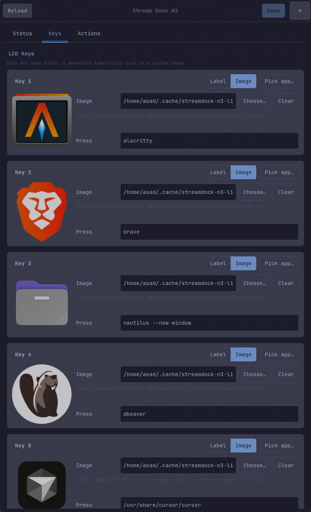
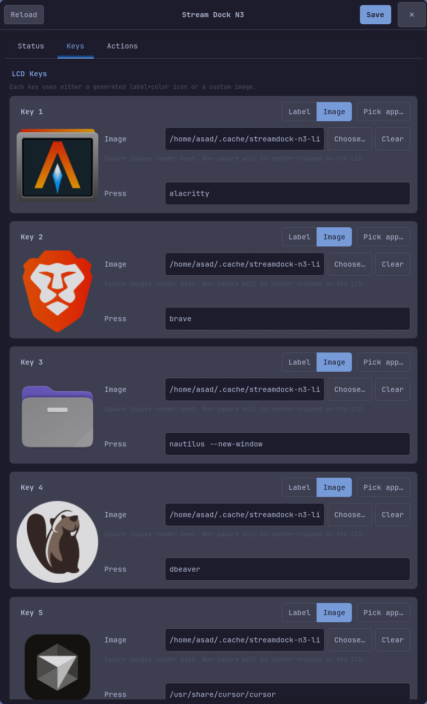
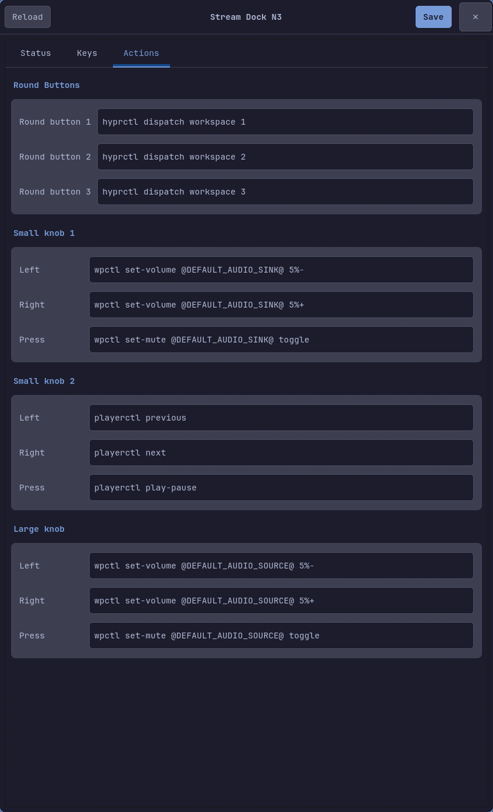

# Stream Dock N3 for Linux

[](https://github.com/asad-albadi/streamdock-n3/releases/latest)
[](https://github.com/asad-albadi/streamdock-n3/actions/workflows/ci.yml)
[](LICENSE)

A daemon and GTK4 GUI that turns the FHOOU / Mirabox **Stream Dock N3** (USB `6603:1003`) into a real Linux macropad — bind any of the 6 LCD keys, 3 round buttons, and 3 knobs to shell commands, control volume / media / workspaces, and edit it all from a themed GUI.

## Install

```bash
curl -fsSL https://raw.githubusercontent.com/asad-albadi/streamdock-n3/master/install.sh | bash
```

That's it. The script fetches the latest release wheel, installs it via `pipx` (with `--system-site-packages` so the GUI can import PyGObject), then runs `sudo streamdock-n3-install` to drop the udev rule, systemd user service, and desktop entry. You'll be prompted for your sudo password once.

After it finishes:

```bash
systemctl --user daemon-reload
systemctl --user enable --now streamdock-n3.service
```

Unplug and replug the dock once so the new udev rules apply.

### Requirements

- Linux (tested on Arch / Omarchy).
- Python 3.11+, `pipx` (or `pip --user`).
- For the GUI: distro-provided GTK 4 + `python-gobject`. On Arch: `pacman -S gtk4 python-gobject`.

### Variations

```bash
# Pin to a specific release tag (skip the floating "latest" lookup):
curl -fsSL https://raw.githubusercontent.com/asad-albadi/streamdock-n3/master/install.sh \
    | bash -s -- --version v0.2.0

# Install the wheel only — skip the sudo step that drops system files:
curl -fsSL https://raw.githubusercontent.com/asad-albadi/streamdock-n3/master/install.sh \
    | bash -s -- --no-system

# Pin both the installer and the wheel to one tag (most reproducible):
curl -fsSL https://raw.githubusercontent.com/asad-albadi/streamdock-n3/v0.2.0/install.sh \
    | bash -s -- --version v0.2.0
```

## How it works

- `/dev/hidraw*` — vendor HID interface used by the official SDK for LCD images, brightness, and button reports.
- `/dev/input/event*` — keyboard-style input interface used by some firmware modes for media keys.

The official StreamDock Device SDK is vendored under `src/streamdock_n3/_vendor/StreamDock/` because the pip-installable upstream did not ship the Linux native transport in this environment.

### Manual

```bash
# Use --system-site-packages so the GUI can import the system PyGObject.
pipx install --system-site-packages streamdock-n3-linux   # once PyPI publishing is enabled
sudo streamdock-n3-install                                 # udev rule + systemd unit + desktop entry
systemctl --user daemon-reload
systemctl --user enable --now streamdock-n3.service
```

> **Why `--system-site-packages`?** The GUI uses GTK4 via `python-gobject`, which is provided by the distro and not reliably installable via pip. Sharing the user's site-packages lets `streamdock-n3-gui` import it. The daemon and probe/debug entry points work either way.

Then unplug and replug the Stream Dock so udev rules apply.

### From source

```bash
git clone https://github.com/asad-albadi/streamdock-n3
cd streamdock-n3
pipx install --force .
sudo streamdock-n3-install
```

Or for distro packaging:

```bash
make build
make DESTDIR=$pkgdir install
```

## Commands

After install you have five entry points on your PATH:

```text
streamdock-n3          Daemon. Reads ~/.config/streamdock-n3/config.json,
                       applies LCD icons + brightness, dispatches events.
streamdock-n3-gui      GTK4 GUI for editing the config.
streamdock-n3-probe    SDK smoke test (enumerate, set test icons, print events).
streamdock-n3-debug    Raw hidraw + evdev diagnostics.
streamdock-n3-install  Install udev rule, systemd user unit, desktop entry
                       (run with sudo).
```

`streamdock-n3` flags:

```text
--config PATH       Override config path (default: $XDG_CONFIG_HOME/streamdock-n3/config.json).
--brightness N      Override configured brightness, 0-100.
--dry-run           Print actions without running commands.
--no-icons          Do not update LCD key images.
--no-init           Skip SDK initialization.
--seconds N         Exit after N seconds; useful for tests.
```

## GUI

| Status | Keys | Actions |
|---|---|---|
|  |  |  |

- **Status** detects the dock via `/sys/bus/usb/devices`, exposes Start / Restart / Stop, brightness slider, and an Install button that runs `pkexec streamdock-n3-install`.
- **Keys** has one card per LCD key. Each key is either **Label** mode (text + background color) or **Image** mode (custom image path, center-cropped to square). **Pick app…** scans `.desktop` files and assigns the chosen app's icon + `Exec` command in one step.
- **Actions** edits the three round-button and three-knob (left / right / press) command mappings.

The GUI re-styles itself from `~/.config/omarchy/current/theme/colors.toml` and watches it with `Gio.FileMonitor` so theme switches apply live.

`streamdock-n3-gui --tab N` (0, 1, 2) opens directly on Status / Keys / Actions. Logs go to `$XDG_STATE_HOME/streamdock-n3/gui.log`.

## Configuration

Config lives at `$XDG_CONFIG_HOME/streamdock-n3/config.json` (typically `~/.config/streamdock-n3/config.json`). A default is seeded on first run.

```json
{
  "brightness": 80,
  "keys": {
    "1": { "label": "Term", "color": "#1c63b8" }
  },
  "actions": {
    "button.1.press": "alacritty"
  }
}
```

Key fields:

```text
label    Text rendered into a generated LCD icon.
color    Hex background color for the generated icon.
icon     Optional custom image path. If present and valid, it is used instead.
```

Actions are mapped by event name to a shell command string or list of strings.

## Event Names

SDK/HID:

```text
button.1.press through button.9.press
button.1.release through button.9.release
knob.1.left, knob.1.right, knob.1.press, knob.1.release
knob.2.left, knob.2.right, knob.2.press, knob.2.release
knob.3.left, knob.3.right, knob.3.press, knob.3.release
```

Evdev fallback:

```text
evdev.KEY_NAME.press
evdev.KEY_NAME.release
evdev.KEY_NAME.repeat
```

Default mapping:

```text
1  Term   alacritty                  knob 1  speaker volume / mute
2  Web    chromium                   knob 2  media prev/next / play-pause
3  Files  xdg-open "$HOME"           knob 3  mic volume / mute
4  OBS    obs                        button 7  workspace 1
5  Mute   wpctl speaker mute toggle  button 8  workspace 2
6  Play   playerctl play-pause       button 9  workspace 3
```

## Diagnostics

```bash
streamdock-n3-debug --seconds 20
streamdock-n3-probe --no-icons --map
```

Press all keys, knobs, and rotations while `streamdock-n3-debug` runs. If you see an `evdev.KEY_...` name that is not in your config, add it under `actions`.

## Troubleshooting

If buttons do nothing:

```bash
sudo streamdock-n3-install
# unplug + replug the dock
ls -l /dev/hidraw* /dev/input/event*
```

Dry-run to inspect what the daemon would do:

```bash
streamdock-n3 --dry-run
```

## Development

```bash
uv sync --extra dev
uv run pytest
uv run ruff check .
```

Build a wheel:

```bash
uv build
```

Release flow:

```bash
# bump version in pyproject.toml, commit, tag, push:
git tag v0.2.1
git push --tags
# GitHub Actions builds the wheel + sdist and publishes the release.
```

## Project Files

```text
src/streamdock_n3/
  daemon.py          Daemon (streamdock-n3 entry point).
  gui.py             GTK4 GUI (streamdock-n3-gui).
  probe.py           SDK smoke test (streamdock-n3-probe).
  debug_tool.py      Raw hidraw + evdev diag (streamdock-n3-debug).
  system_install.py  Install udev/service/desktop (streamdock-n3-install).
  config.py          XDG config IO + defaults.
  events.py          Event name mapping.
  icons.py           Generated LCD icons + color parsing.
  paths.py           XDG path helpers.
  _data/             Packaged udev rule, systemd unit, desktop entry, default config.
  _vendor/StreamDock/  Vendored official SDK + native transport.

tests/               Unit tests.
.github/workflows/   CI + release workflows.
Makefile             Source-tree installer for distro packagers.
install.sh           One-shot end-user installer.
```

## Known Limitations

- Not a full clone of the Windows/macOS Stream Dock software UI.
- Profiles, folders, and macro editing are not implemented.
- Actions are shell commands in JSON.
- Knob event names may vary by firmware mode — use `streamdock-n3-debug` to confirm.
- The vendored SDK is bundled because the upstream pip package did not include the Linux native transport in this environment.
